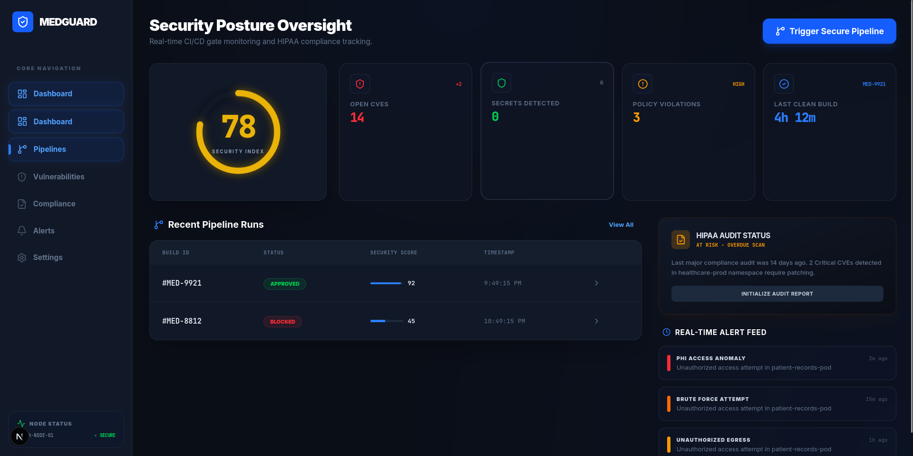

# 🛡️ MedGuard: DevSecOps Dashboard

**MedGuard** is a security-first CI/CD control plane designed for HIPAA-regulated healthcare environments. It visualizes an 8-stage secure pipeline, enforces stringent compliance policies, and provides real-time security oversight.



## 🚀 Overview

In healthcare platform engineering, security isn't a final step—it's embedded at every stage. MedGuard integrates industry-standard security tooling (SAST, SCA, DAST, OPA) into a unified dashboard that gates deployments based on real-time risk posture.

### Core Features

- **8-Stage Secure Pipeline**: Visual tracking of Source, SAST, SCA, Docker Build, Image Scan, Secrets Detection, K8s Policy Gate, and DAST.
- **Fail-Closed Policy**: Automated deployment blocking if `CRITICAL` vulnerabilities or policy violations are detected.
- **HIPAA Compliance Registry**: Automated technical control mapping (Access Control, Audit Controls, Integrity) with exportable evidence.
- **Real-time Alert Feed**: Live security event streaming using Server-Sent Events (SSE) for anomaly detection.
- **Vulnerability SLA Tracker**: Real-time tracking of CVE remediation timelines against HIPAA-mandated windows.

## 🛠️ Tech Stack

- **Framework**: [Next.js 14+](https://nextjs.org/) (App Router)
- **Styling**: [Tailwind CSS 4](https://tailwindcss.com/)
- **Animations**: [Framer Motion](https://www.framer.com/motion/)
- **Icons**: [Lucide React](https://lucide.dev/)
- **Language**: [TypeScript](https://www.typescriptlang.org/)

## 🏗️ Architecture

MedGuard utilizes a **Security Simulation Engine** that mocks a real-world secure CI/CD environment:

1. **Trigger**: User initiates a pipeline run.
2. **Simulation**: The engine runs through 8 stages, generating randomized but realistic security findings (e.g., SQLi, vulnerable base images, leaked AWS keys).
3. **Evaluation**: If a `CRITICAL` finding exists, the deployment is marked as `BLOCKED`.
4. **Monitoring**: Real-time alerts are streamed to the dashboard for immediate remediation.

## 🏁 Getting Started

### Prerequisites
- Node.js 18.x or higher
- npm or yarn

### Installation

1. Clone the repository:
   ```bash
   git clone <repository-url>
   cd devsecops-healthcare
   ```

2. Install dependencies:
   ```bash
   npm install
   ```

3. Run the development server:
   ```bash
   npm run dev
   ```

4. Open [http://localhost:3000](http://localhost:3000) in your browser.

## 📄 License
This project is licensed under the MIT License - see the LICENSE file for details.

---
*Built for the DevSecOps & Healthcare Engineering community.*
