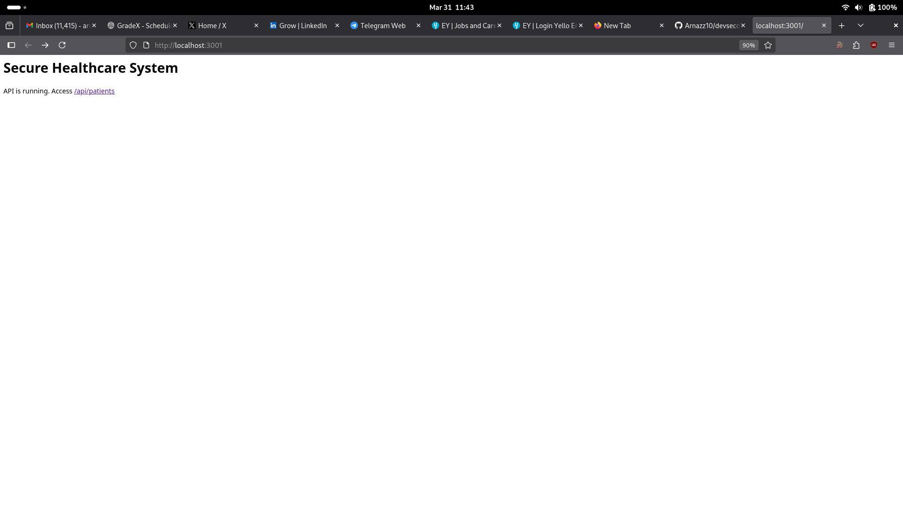
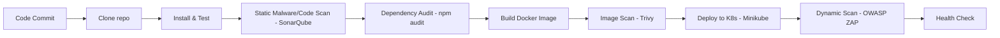

# Secure DevOps (DevSecOps) Implementation in a Healthcare System


This project demonstrates a robust and secure CI/CD pipeline for a Node.js-based healthcare application. It integrates multiple security layers—from static code analysis to dynamic testing and container scanning—ensuring the application is secure before it reaches production.

## 🏥 Healthcare Application Features
- **Patient Record API**: Secure endpoints to add and view patient metadata.
- **Role-Based Access Control (RBAC)**: Simulation of roles (Admin, Doctor, Guest) for sensitive data access.
- **Health Check**: `/health` endpoint for monitoring and orchestration (Liveness/Readiness probes).
- **Security-First Headers**: Integrated `Helmet.js` and input validation.

### Preview


## 🛡️ DevSecOps Pipeline Overview



### Security Gates
The pipeline is configured to **Fail Fast**:
- **SonarQube**: Fails if the Quality Gate (bugs, vulnerabilities, code smells) is not met.
- **Dependency Scan**: Fails if HIGH or CRITICAL vulnerabilities are detected.
- **Trivy Image Scan**: Fails if the Docker image has severe security flaws.
- **OWASP ZAP**: Dynamic baseline scan to identify common web vulnerabilities.

## 🚀 Quick Start (Local Setup)

### Prerequisites
- Docker & Docker Compose
- Minikube
- Node.js (for local testing)

### 1. Start the Environment
Run the security stack using Docker Compose:
```bash
docker-compose up -d
```
This launches **SonarQube** (Port 9000) and **Jenkins** (Port 8080).

### 2. Configure Jenkins
1. Connect Jenkins to the repository.
2. Ensure the following plugins are installed: `SonarQube Scanner`, `Docker Pipeline`, `Kubernetes Continuous Deploy`.
3. Add the `SonarQube` server URL in Jenkins global configuration.

### 3. Run Locally
```bash
cd app
npm install
npm start
```
By default, the app runs on **port 3001** (check `.env`).

## 📁 Project Structure
- `/app`: The Node.js application and its unit tests.
- `/docker`: Dockerfile for generating optimized images.
- `/jenkins`: The Jenkinsfile defining the secure pipeline.
- `/k8s`: Kubernetes manifests (Deployment, Service, Namespace).
- `/security`: Helper scripts for Trivy and OWASP ZAP.

## 🧪 Security Validation
- **Simulate Vulnerability**: Install a package with a known vulnerability (e.g., `axios@0.21.0`).
- **Trigger Failure**: The pipeline will automatically stop at the `Dependency Check` stage.
- **Verification**: Check the SonarQube dashboard for deep code analysis results.

---

### Author
Arnab (@Arnazz10)
